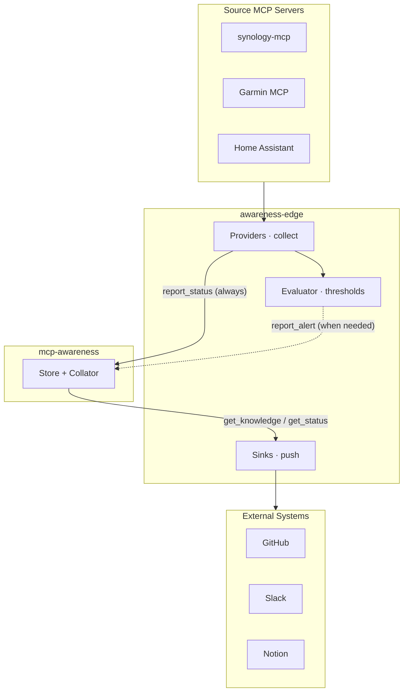

# awareness-edge

> Collect. Evaluate. Report. The bridge between your systems and your AI assistant's awareness.

> [!NOTE]
> This project is under active development. It is the companion service to [mcp-awareness](https://github.com/cmeans/mcp-awareness).

## What it does

`awareness-edge` is a bidirectional polling service that bridges source systems and the [mcp-awareness](https://github.com/cmeans/mcp-awareness) knowledge store.

- **Inbound** (providers): collect metrics from source MCP servers (Synology NAS, Garmin, Home Assistant), evaluate against thresholds, report status and alerts
- **Outbound** (sinks): read from awareness, push to external systems (GitHub, Slack, Notion)

The result: your AI assistant knows about your systems without you having to ask.

## Architecture

**Providers** (inbound): collect metrics from source MCPs, report status every cycle. Deterministic, no external dependencies.

**Evaluator** (thresholds): "Is anything here worth alerting about?" Configurable metric thresholds with pluggable interface for future extension.

**Sinks** (outbound): read from awareness, push to external targets. Each sink queries for exactly the data it needs.

## Providers & Sinks

| Component | Type | Status | Docs |
|-----------|------|--------|------|
| Demo provider | provider | built-in | [docs/providers/demo.md](docs/providers/demo.md) |
| Demo sink | sink | built-in | [docs/sinks/demo.md](docs/sinks/demo.md) |
| GitHub prompt sync | sink | built-in | [docs/sinks/github.md](docs/sinks/github.md) |
| Synology NAS | provider | planned | — |
| Garmin health | provider | planned | — |

## Tools

| Tool | Description |
|------|-------------|
| [`examples/audit_store.py`](examples/audit_store.py) | Audits the awareness store for tag drift, mistyped patterns, source naming issues, and low-quality entries. Reports findings as a single GitHub issue (or `--dry-run` to stdout). Fingerprints results to skip redundant updates. |

## First source: Synology NAS

Uses [synology-mcp](https://github.com/cmeans/synology-mcp) tools:
- `get_resource_usage` — CPU, memory, disk I/O, network
- `get_system_info` — model, firmware, temperature, uptime

The NAS is a seedbox — 80-90% disk I/O and high CPU from qBittorrent is normal. The evaluator focuses on structural changes (processes stopped, unexpected quiet) rather than high numbers.

## Acknowledgements

This project was designed and built collaboratively by [Chris Means](https://github.com/cmeans) and [Claude](https://claude.ai) (Anthropic's AI assistant). The initial architecture — a bidirectional bridge between source MCPs and the awareness store — was sketched out in conversation across Claude Android and Claude Code. Claude Code scaffolded the codebase, wrote the tests, and iterated on design decisions (like stripping Ollama in favor of deterministic thresholds) based on Chris's feedback. The [mcp-awareness](https://github.com/cmeans/mcp-awareness) knowledge store served as the shared context layer throughout, letting both platforms stay aligned on project state.

## License

Apache 2.0 — see [LICENSE](LICENSE) for details.

---

Copyright (c) 2026 Chris Means
