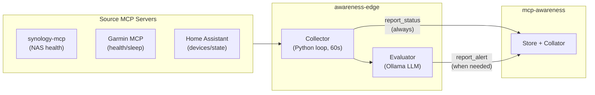

# awareness-edge

> Collect. Evaluate. Report. The bridge between your systems and your AI assistant's awareness.

> [!NOTE]
> This project is under active development. It is the companion agent to [mcp-awareness](https://github.com/cmeans/mcp-awareness).

## What it does

`awareness-edge` is an MCP-to-MCP bridge agent. It polls data from source MCP servers (Synology NAS, Garmin, Home Assistant, etc.), uses a local LLM to evaluate whether anything needs attention, and writes status and alerts to the [mcp-awareness](https://github.com/cmeans/mcp-awareness) service.

The result: your AI assistant knows about your systems without you having to ask.

## Architecture

**Deterministic layer** (Python): authentication, scheduling, MCP connections, data collection, status reporting. Runs every cycle, never fails due to LLM issues.

**Evaluation layer** (Ollama): "Is anything here worth alerting about?" Classification task on structured metrics. Isolated, testable, model-swappable.

## First source: Synology NAS

Uses [synology-mcp](https://github.com/cmeans/synology-mcp) tools:
- `get_resource_usage` — CPU, memory, disk I/O, network
- `get_system_info` — model, firmware, temperature, uptime

The NAS is a seedbox — 80-90% disk I/O and high CPU from qBittorrent is normal. The evaluator focuses on structural changes (processes stopped, unexpected quiet) rather than high numbers.

## License

Apache 2.0

---

Copyright (c) 2026 Chris Means
